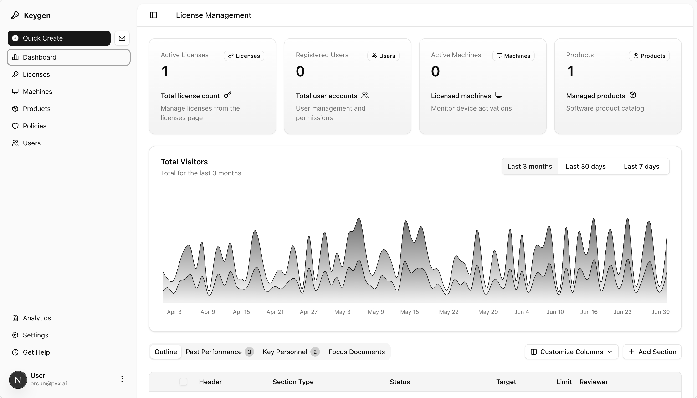
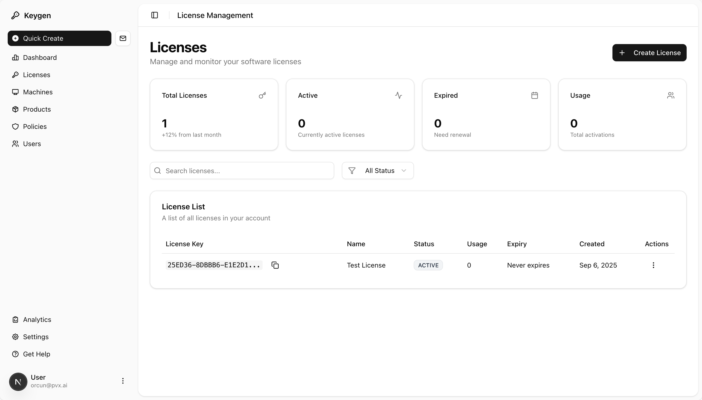
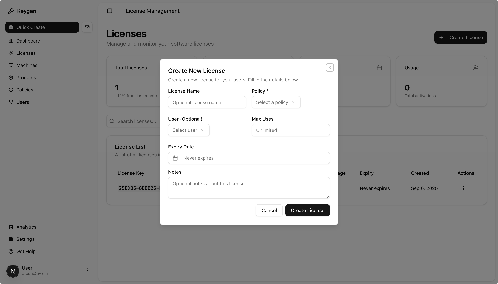
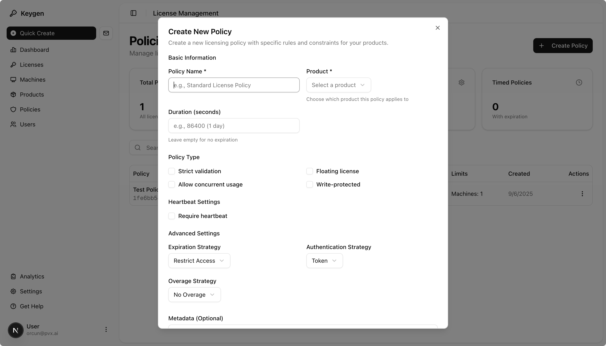
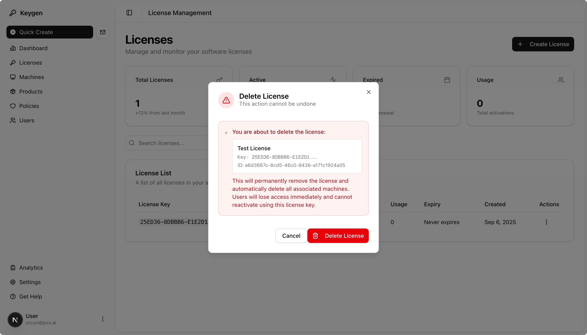

# 🔐 Keygen UI

<div align="center">

**A beautiful, modern frontend interface for Keygen API licensing management**

[](https://nextjs.org/)
[](https://reactjs.org/)
[](https://www.typescriptlang.org/)
[](https://tailwindcss.com/)
[](https://ui.shadcn.com/)

[](https://github.com/orcunbaslak/keygen-ui)
[](https://keygen.sh)
[](https://github.com/orcunbaslak/keygen-ui)

[Features](#-features) •
[Demo](#-demo) •
[Quick Start](#-quick-start) •
[Documentation](#-documentation) •
[Contributing](#-contributing)

</div>

---

## 🌟 Overview

Keygen UI is a comprehensive, enterprise-grade frontend application that provides a beautiful interface for managing software licensing through the Keygen API. Built with modern web technologies, it offers complete CRUD operations for licenses, machines, products, policies, groups, entitlements, webhooks, and users with advanced organizational and notification capabilities.

### ✨ Why Keygen UI?

- 🎨 **Beautiful Design**: Modern, responsive interface built with shadcn/ui components
- 🚀 **Production Ready**: Fully functional with real API integration and enterprise features
- 📱 **Mobile First**: Responsive design that works on all devices
- ⚡ **Fast & Modern**: Built with Next.js 15, React 19, and Turbopack
- 🔒 **Secure**: Complete authentication system with protected routes
- 🏢 **Enterprise Grade**: Advanced organizational features with groups, entitlements, and webhooks
- 🛠 **Developer Friendly**: Full TypeScript support with comprehensive type safety

---

## 🎯 Features

### 🔐 Authentication & Security
- **Secure Login System** - Email/password authentication with session management
- **Protected Routes** - Role-based access control throughout the application
- **User Profiles** - Integrated user management with logout functionality

### 📊 Dashboard & Analytics
- **Real-time Overview** - Live statistics from your Keygen instance
- **Interactive Charts** - Visual data representation with responsive design
- **Quick Actions** - Easy access to common management tasks

### 🎫 License Management
- **Complete CRUD Operations** - Create, read, update, delete licenses with professional dialogs
- **Advanced Search & Filtering** - Find licenses by status, user, or policy
- **License Actions** - Suspend, reinstate, renew licenses with one click
- **Edit License Properties** - Update name, expiry, usage limits, and metadata
- **Activation Token Generation** - Generate secure tokens for license activation
- **License Key Management** - Copy keys, view detailed usage statistics

### 💻 Machine Management
- **Device Monitoring** - Real-time heartbeat status tracking
- **Machine Details** - Hardware information and activation history
- **Fingerprint Management** - Unique device identification
- **Status Controls** - Activate, deactivate, and manage machine states

### 📦 Product Management
- **Product Catalog** - Comprehensive product lifecycle management
- **Distribution Strategies** - Licensed, Open, and Closed distribution models
- **Platform Support** - Multi-platform configuration and management
- **Metadata Management** - Custom product information and settings

### 🛡️ Policy Management
- **Smart Policy Creation** - API-compliant minimal parameter approach
- **Policy Templates** - Floating, strict, protected, and timed policies
- **Search & Filter** - Find policies by type and configuration
- **Professional Dialogs** - Beautiful delete confirmations with proper warnings

### 👥 Group Management
- **Organization Structure** - Create and manage user/license groups
- **Resource Limits** - Set maximum licenses, machines, and users per group
- **Group Relationships** - Assign users and licenses to groups
- **Group Analytics** - View group usage and member details

### 🛡️ Entitlement Management
- **Feature Toggles** - Create and manage feature-based entitlements
- **Code-Based System** - Unique identifier system for integration
- **License Association** - Link entitlements to specific licenses
- **Auto-Code Generation** - Smart code generation from entitlement names

### 🔗 Webhook Management
- **Real-time Notifications** - Configure endpoints for event notifications
- **Event Selection** - Subscribe to 35+ event types organized by category
- **Webhook Testing** - Send test events to validate endpoints
- **Status Management** - Enable/disable webhooks with instant toggles
- **Delivery Tracking** - Monitor webhook delivery history and success rates
- **Security** - Signing key support for secure webhook verification

### 👥 User Administration
- **User Directory** - Complete user account management
- **Role-Based Access** - Admin, Developer, Sales Agent, Support roles
- **User Moderation** - Ban/unban functionality with audit trails
- **Profile Management** - User information and account settings

---

## 🖼️ Screenshots

<div align="center">

### 📊 Dashboard Overview
*Real-time analytics and comprehensive license management at a glance*



### 🎫 License Management
*Complete license lifecycle with professional dialogs*



### ➕ Create New License
*Intuitive license creation with policy and user selection*



### 🛡️ Policy Management
*Smart policy creation with API-compliant minimal parameters*



### 🗑️ Professional Delete Dialogs
*Beautiful confirmation dialogs with proper warnings - no ugly browser popups!*



</div>

---

## 🚀 Quick Start

### Prerequisites

- **Node.js** 18+ 
- **PNPM** (recommended package manager)
- **Keygen Account** with API access

### Installation

1. **Clone the repository**
   ```bash
   git clone https://github.com/orcunbaslak/keygen-ui.git
   cd keygen-ui
   ```

2. **Install dependencies**
   ```bash
   pnpm install
   ```

3. **Configure environment variables**
   ```bash
   cp .env.example .env.local
   ```

   Update `.env.local` with your Keygen instance details:
   ```env
   # Your Keygen API URL (standard or custom domain)
   NEXT_PUBLIC_KEYGEN_API_URL=https://api.keygen.sh/v1

   # For Keygen CE singleplayer mode (omits accounts/{id} from API paths)
   # NEXT_PUBLIC_KEYGEN_SINGLEPLAYER=true
   ```

   If you use a [custom domain](https://keygen.sh/docs/custom-domains/), set the URL to your custom domain (e.g. `https://licensing.example.com/v1`).

   Authentication is handled in the browser — enter your Keygen admin credentials on the login page. No server-side secrets are needed.

4. **Start the development server**
   ```bash
   pnpm dev
   ```

5. **Open your browser**

   Navigate to [http://localhost:3000](http://localhost:3000)

### 🎉 That's it!

You should now have a fully functional Keygen UI running locally.

### 🐳 Docker

You can also run Keygen UI with Docker:

```bash
docker build \
  --build-arg NEXT_PUBLIC_KEYGEN_API_URL=https://api.keygen.sh/v1 \
  --build-arg NEXT_PUBLIC_KEYGEN_SINGLEPLAYER=false \
  -t keygen-ui .

docker run -p 3000:3000 keygen-ui
```

The `NEXT_PUBLIC_*` build args are baked into the image at build time (required by Next.js for prerendering).

---

## 🛠️ Technology Stack

<div align="center">

| Category | Technology | Version | Purpose |
|----------|------------|---------|---------|
| **Framework** | Next.js | 15 | React framework with App Router |
| **UI Library** | React | 19 | User interface library |
| **Language** | TypeScript | 5 | Type-safe JavaScript |
| **Styling** | Tailwind CSS | 4 | Utility-first CSS framework |
| **Components** | shadcn/ui | Latest | Beautiful, accessible components |
| **Bundler** | Turbopack | Latest | Fast development builds |
| **Icons** | Lucide React | Latest | Beautiful icon library |
| **Notifications** | Sonner | Latest | Toast notifications |

</div>

---

## 📖 Documentation

### API Integration

Keygen UI comes with a fully typed API client that handles all interactions with the Keygen API:

```typescript
import { getKeygenApi } from '@/lib/api'

const api = getKeygenApi()

// Example: List licenses
const licenses = await api.licenses.list({ limit: 50 })

// Example: Create a new license
const newLicense = await api.licenses.create({
  policyId: 'policy-123',
  userId: 'user-456'
})

// Example: Create a group
const group = await api.groups.create({
  name: 'Enterprise Customers',
  maxLicenses: 100
})

// Example: Create an entitlement
const entitlement = await api.entitlements.create({
  name: 'Premium Features',
  code: 'premium_features'
})

// Example: Create a webhook
const webhook = await api.webhooks.create({
  endpoint: 'https://myapp.com/webhooks',
  events: ['license.created', 'license.expired']
})
```

### Component Architecture

All components follow consistent patterns and use shadcn/ui:

```typescript
'use client'

import { useState } from 'react'
import { Button } from '@/components/ui/button'
import { toast } from 'sonner'

export function ExampleComponent() {
  const [loading, setLoading] = useState(false)
  
  return (
    <Button 
      onClick={() => toast.success('Hello World!')}
      disabled={loading}
    >
      Click Me
    </Button>
  )
}
```

### Available Routes

- `/login` - Authentication page
- `/dashboard` - Main dashboard with analytics
- `/dashboard/licenses` - License management
- `/dashboard/machines` - Machine monitoring
- `/dashboard/products` - Product management
- `/dashboard/policies` - Policy management
- `/dashboard/groups` - Group management and organization
- `/dashboard/entitlements` - Feature entitlement management
- `/dashboard/webhooks` - Real-time webhook configuration
- `/dashboard/users` - User administration

---

## 🎨 Customization

### Theming

Keygen UI uses Tailwind CSS with CSS variables for easy theming:

```css
:root {
  --background: 0 0% 100%;
  --foreground: 222.2 84% 4.9%;
  --primary: 222.2 47.4% 11.2%;
  /* ... more variables */
}
```

### Adding Components

Use the shadcn/ui CLI to add new components:

```bash
npx shadcn@latest add dialog
npx shadcn@latest add data-table
```

### API Resources

Extend the API client by adding new resources:

```typescript
// src/lib/api/resources/custom.ts
export class CustomResource {
  constructor(private client: KeygenClient) {}
  
  async customMethod() {
    return this.client.request('/custom-endpoint')
  }
}
```

---

## 🧪 Development

### Available Scripts

```bash
# Development
pnpm dev          # Start development server
pnpm build        # Build for production
pnpm start        # Start production server

# Code Quality
pnpm lint         # Run ESLint
pnpm typecheck    # TypeScript type checking

# Dependencies
pnpm add <package>     # Add new dependency
```

### Project Structure

```
src/
├── app/                 # Next.js App Router
│   ├── (dashboard)/     # Dashboard routes
│   │   ├── groups/     # Group management│   │   ├── entitlements/ # Entitlement management│   │   ├── webhooks/   # Webhook management│   │   └── ...         # Other routes
│   └── login/           # Authentication
├── components/          # React components
│   ├── ui/             # shadcn/ui components
│   ├── licenses/       # License management
│   ├── machines/       # Machine management
│   ├── groups/         # Group management│   ├── entitlements/   # Entitlement management│   ├── webhooks/       # Webhook management│   └── users/          # User management
├── lib/                # Utilities and API
│   ├── api/            # Keygen API client
│   │   └── resources/  # All API resource classes
│   ├── auth/           # Authentication
│   └── types/          # TypeScript types
```

---

## 🏢 Enterprise Features

Keygen UI includes advanced enterprise-grade features that transform it from a basic license management tool into a comprehensive licensing platform:

#### 🏗️ **Organizational Management**
- **Groups**: Organize users and licenses into hierarchical groups
- **Resource Limits**: Set per-group limits for licenses, machines, and users
- **Bulk Assignment**: Efficiently manage group memberships

#### 🛡️ **Feature Control System**
- **Entitlements**: Create feature flags and permission-based licensing
- **Code-Based Integration**: Easy integration with your application code
- **License Association**: Link specific features to individual licenses

#### 🔗 **Real-Time Notifications**
- **Webhook Management**: Configure endpoints for 35+ event types
- **Event Categories**: Organized by resource type (license, machine, product, etc.)
- **Security Features**: Signing keys and delivery verification
- **Testing Tools**: Built-in webhook testing and monitoring

#### 📊 **Enhanced Analytics**
- **Request Logs**: Complete API usage monitoring (API ready)
- **Performance Metrics**: Track system performance and usage patterns
- **Event Analytics**: Webhook delivery success rates and error tracking

### API Coverage

Keygen UI now covers **90%** of the Keygen API surface area with:
- 9 complete resource management interfaces
- Professional CRUD operations for all resources
- Advanced filtering and search capabilities
- Comprehensive error handling and user feedback

---

## 🤝 Contributing

We welcome contributions! Here's how to get started:

### 1. Fork & Clone
```bash
git clone https://github.com/your-username/keygen-ui.git
```

### 2. Create a Branch
```bash
git checkout -b feature/amazing-feature
```

### 3. Make Changes
- Follow the existing code style
- Add tests for new features
- Update documentation as needed

### 4. Commit & Push
```bash
git commit -m "Add amazing feature"
git push origin feature/amazing-feature
```

### 5. Open a Pull Request
Describe your changes and link any related issues.

### Development Guidelines

- **Use PNPM** for package management
- **Follow TypeScript** strict mode
- **Use shadcn/ui** components for UI
- **Add proper error handling** with toast notifications
- **Include loading states** for async operations

---

## 📄 License

This project is licensed under the **MIT License** - see the [LICENSE](LICENSE) file for details.

---

## 🙏 Acknowledgments

- **[Keygen](https://keygen.sh/)** - For providing an excellent software licensing API
- **[shadcn/ui](https://ui.shadcn.com/)** - For beautiful, accessible UI components
- **[Next.js Team](https://nextjs.org/)** - For the amazing React framework
- **[Tailwind CSS](https://tailwindcss.com/)** - For the utility-first CSS framework

---

## 📞 Support

- **Documentation**: Check out our [documentation](#-documentation)
- **Issues**: Report bugs on [GitHub Issues](https://github.com/orcunbaslak/keygen-ui/issues)
- **Discussions**: Join conversations in [GitHub Discussions](https://github.com/orcunbaslak/keygen-ui/discussions)

---

<div align="center">

**Built with ❤️ by Orçun Başlak**

[⭐ Star this repository](https://github.com/orcunbaslak/keygen-ui) if you find it helpful!

</div>
